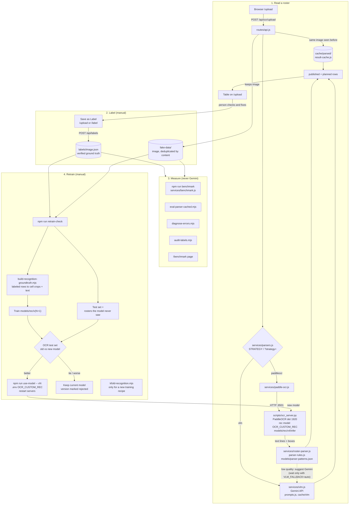

# Node OCR

Reads crew roster screenshots and returns the rows of the two roster tables,
**"Published roster"** and **"Rest of this roster is planned"**, as structured
data (`date, day, duty, dep, begin, end, arr`). Other text on the page is ignored.

Current state (2026-10-08): recognition model **v4** (`models/rec/v4`), parser
row accuracy 97.1% on the labeled rosters (95.6% on 16 rosters the model never
trained on, before the 2026-10-07 parser fixes). Nothing learns or retrains on its own: the model and parser only change
when you run a command and choose to switch.

**New here?** Jump to [Getting started](#getting-started) to install and run it.

## Architecture



Same diagram as plain text (for terminals):

```
 ┌──────────────────────────── 1. READ A ROSTER ─────────────────────────────┐
 │                                                                           │
 │  Browser /upload ──POST /api/ocr/upload──> routes/api.js                  │
 │                                              │  same image seen before?   │
 │                                              ├─yes─> cache/parsed/        │
 │                                              │      (result-cache.js)     │
 │                                              │                            │
 │                                              ▼                            │
 │                                    services/parsers.js                    │
 │                                    STRATEGY / ?strategy=                  │
 │                      ┌──── paddleocr ────────┴──────── vlm ────┐          │
 │                      ▼                                         ▼          │
 │          services/paddle-ocr.js                      services/vlm.js      │
 │                      │ HTTP :8501                     Gemini API          │
 │                      ▼                                (prompts.js,        │
 │          scripts/ocr_server.py                         cache/vlm)         │
 │          PaddleOCR det (1920) +                               ▲           │
 │          rec model OCR_CUSTOM_REC                             │           │
 │          (models/rec/v4/infer)                                │           │
 │                      │ text lines + boxes                     │           │
 │                      ▼                                        │           │
 │          services/roster-parser.js  ── low quality? ──────────┘           │
 │          (+ parser-rules.js,           (VLM_FALLBACK, needs VLM_API_KEY)  │
 │           models/parser-patterns.json)                                    │
 │                      │                                                    │
 │                      ▼                                                    │
 │          { published: [...], planned: [...] } ──> table on /upload        │
 └───────────────────────────────────┬───────────────────────────────────────┘
                                     │ a person checks / fixes the table
                                     ▼
 ┌──────────────────────────── 2. LABEL (manual) ────────────────────────────┐
 │  upload keeps the image in fake-data/ (deduplicated by content)           │
 │  "Save as Label" on /upload or /label ──POST /api/labels──>               │
 │      labels/<image>.json   (verified ground truth)                        │
 └────────────┬───────────────────────────────────────┬──────────────────────┘
              │                                       │
              ▼                                       ▼
 ┌────── 3. MEASURE ───────┐  ┌──────────── 4. RETRAIN (manual) ─────────────┐
 │ npm run benchmark       │  │ npm run retrain-check                        │
 │ services/benchmark.js   │  │ ├ test = rosters the model never saw         │
 │ (PaddleOCR + parser,    │  │ ├ build-recognition-groundtruth.mjs:         │
 │  never Gemini)          │  │ │   labeled rows -> cell crops + text        │
 │ eval-parser-cached.mjs  │  │ ├ train -> models/rec/v(N+1)                 │
 │ diagnose-errors.mjs     │  │ └ OCR test set with old + new model          │
 │ audit-labels.mjs        │  │     -> better / tie / worse                  │
 │ /benchmark page         │  │                                              │
 └─────────────────────────┘  │ better? npm run use-model -- vN              │
                              │   -> .env OCR_CUSTOM_REC, restart            │
                              │   -> back to 1 with the new model            │
                              │                                              │
                              │ new recipe? kfold-recognition.mjs            │
                              └──────────────────────────────────────────────┘
```

The four steps:

1. **Read.** `ocr_server.py` finds the text lines and reads them with the fine-tuned
   model. `roster-parser.js` turns those lines into rows of the two tables. Gemini is
   used only when you choose it; when the PaddleOCR result looks bad, `/upload`
   suggests it.
2. **Label.** Only a person writes labels. Gemini output is never saved as a label
   on its own.
3. **Measure.** Scores always compare against `labels/` and never use Gemini.
4. **Retrain.** Run by hand. A new model version is used only after
   `use-model` switches to it.

## Getting started

### Requirements

| | Version | Notes |
|---|---|---|
| Node.js | **20.6+** (tested on 20.18) | `npm start` uses `node --env-file` |
| Python | **3.11** (tested on 3.11.3) | for the PaddleOCR server |
| GPU (optional) | NVIDIA, CUDA 11.8 runtime | tested on a GTX 1660 Ti (6 GB). The CUDA/cuDNN DLLs come from pip, no separate CUDA install needed. Without a GPU the server falls back to CPU (much slower). |
| OS | Windows 10/11 | the `npm run ocr-server` / `ocr:check` scripts call `.\.venv\Scripts\python`; on Linux/macOS run them with `.venv/bin/python` (see below) |

### 1. Get the code and install

```powershell
git clone https://github.com/thuannd17/node-ocr.git
cd node-ocr

npm install

python -m venv .venv
.\.venv\Scripts\pip install -r scripts/requirements.txt
```

No NVIDIA GPU? In `scripts/requirements.txt` swap `paddlepaddle-gpu==2.6.2` for
`paddlepaddle==2.6.2` (the line is already there, commented out) and drop the
`nvidia-*` lines before installing.

Linux/macOS: `python3.11 -m venv .venv && .venv/bin/pip install -r scripts/requirements.txt`
(use the CPU package on macOS).

### 2. Configure

```powershell
copy .env.example .env      # Linux/macOS: cp .env.example .env
```

The defaults work as is. Only set `VLM_API_KEY` (a Google AI Studio key) if you
want the optional Gemini features; everything else runs offline. All settings are
listed in [`.env`](#env) below.

### 3. Check the OCR runtime

```powershell
npm run ocr:check           # Paddle/PaddleOCR versions, GPU or CPU, test init
```

### 4. Run

Two processes, in two terminals:

```powershell
npm run ocr-server          # terminal 1: PaddleOCR on http://127.0.0.1:8501 ("Ready" when loaded)
npm start                   # terminal 2: app on http://localhost:3000
```

Linux/macOS terminal 1: `.venv/bin/python -u scripts/ocr_server.py`.

Open <http://localhost:3000>, go to **Upload & OCR** and drop a roster screenshot.
The first OCR after starting the server takes a few seconds longer (model warm-up);
after that about 1 s per image on the GPU above.

Quick checks: <http://127.0.0.1:8501/health> (device, queue) and
<http://127.0.0.1:8501/stats> (requests served, queue/inference time).

### 5. Data (not in git)

Roster images and labels are real crew rosters (personal data), so they are **not
in the repository**:

| Folder | Content | On a fresh clone |
|---|---|---|
| `fake-data/` | roster images | created empty on first start; every upload is stored here (deduplicated by content) |
| `labels/` | verified labels, one `<image>.json` per image | created empty; filled by **Save as Label** on `/upload` or `/label` |

Upload and OCR work without any data. `/label` and `/benchmark` only have
something to show once images are uploaded and labeled; to reuse an existing
dataset, copy both folders from the machine that has them.

Also local only: `cache/`, `tmp/` and `exports/` (rebuilt by the app and scripts),
and `models/pretrained/` (downloaded, only needed for retraining, see
[Recognition model versions](#recognition-model-versions)).

### Troubleshooting

| Symptom | Fix |
|---|---|
| Upload says *PaddleOCR server is not reachable* | start `npm run ocr-server` and wait for `Ready`; if it runs elsewhere set `OCR_SERVER_URL` |
| Upload says *OCR server đang bận* | more than `OCR_MAX_QUEUE` (default 4) requests were waiting; retry, or raise `OCR_MAX_QUEUE` |
| `EADDRINUSE` (app) or `WinError 10048` / *Address already in use* (OCR server) | port 3000 / 8501 already used (another copy running?): stop it, or change `PORT` / `OCR_SERVER_PORT` (+ `OCR_SERVER_URL`) |
| OCR server exits with a CUDA/DLL error | rerun `npm run ocr:check`; reinstall `scripts/requirements.txt`, or use the CPU package |
| `npm start` fails with `bad option: --env-file` | Node is older than 20.6 |
| Styles missing after an update | restart `npm start` and hard-reload the page (Ctrl+F5) |

## Pages

| Page | Purpose |
|---|---|
| `/upload` | Upload a roster, check the table, fix cells, **Save as Label**. **Re-parse (VLM)** reads the image with Gemini instead. |
| `/label` | Edit labels; unlabeled images are listed first. |
| `/benchmark` | Score the pipeline against `labels/`. **Xem & sửa** on a file opens `/upload?review=<file>` in a new tab. |
| `/upload?review=<file>` | OCR result of a labeled image with the cells that differ from its label marked (yellow, old value underneath: click to take it), rows OCR missed (blue, filled from the label) and extra rows (struck through). Fix, then **Save as Label**; it asks first if marked cells are still unchecked. |

New rosters: uploads are deduplicated by content and kept in `fake-data/`. A label
is written only when a person presses **Save as Label**. Gemini output is never
saved as a label automatically.

## API

| Route | Description |
|---|---|
| `POST /api/ocr/upload?strategy=paddleocr\|vlm` | multipart field `image`; returns both tables (cached by content, `&force=true` to redo) |
| `GET /api/predict?name=...&strategy=...` | OCR an image already in `fake-data/` |
| `GET /api/review?name=...` | prediction vs label for a labeled image, rows paired like the benchmark |
| `GET /api/labels`, `POST /api/labels` | read / save a label |
| `GET /api/files`, `GET /api/raw` | list images / serve an image |
| `GET /api/benchmark`, `/api/benchmark/stream`, `POST /api/benchmark/stop` | benchmark |

## Gemini (VLM)

Gemini is still available, in three ways:

1. **Suggested on a poor OCR result.** With `STRATEGY=paddleocr`, if the parsed result
   looks bad (fewer than 5 rows, average confidence < 45%, > 30% low-confidence rows,
   or > 20% of rows with a broken critical field), the OCR result is returned at once
   and `/upload` shows a **Thử bằng Gemini** button. `VLM_FALLBACK=auto` calls Gemini
   right away and waits for it instead (the behaviour before 2026-10-07, which made
   some uploads take 40 s+); `VLM_FALLBACK=0` turns Gemini off here.
2. **Per request.** The **Re-parse (VLM)** button, or `?strategy=vlm` on the API.
3. **Everything through Gemini.** `STRATEGY=vlm` in `.env`.

It needs `VLM_API_KEY`. Without a key there is no suggestion and `strategy=vlm`
returns an error. A Gemini call gives up after `VLM_TIMEOUT_MS` (default 30 s).
`/upload` shows how long each step took (OCR, parse, Gemini). `npm run benchmark` never uses the fallback, so
scores measure only PaddleOCR + parser.

## `.env`

```ini
HOST=localhost
PORT=3000

STRATEGY=paddleocr                    # paddleocr (default, offline) | vlm (Gemini)

# Gemini
VLM_PROVIDER=gemini
VLM_API_KEY=...                       # Google AI Studio key
VLM_MODEL=gemini-3.5-flash-lite       # default gemini-3.5-flash
VLM_CACHE_ENABLED=true                # cache Gemini answers in cache/vlm/
# VLM_FALLBACK=auto                   # wait for Gemini on a poor OCR result (default: suggest it)
# VLM_FALLBACK=0                      # never call or suggest Gemini there
# VLM_TIMEOUT_MS=30000                # give up on a Gemini call after this

# PaddleOCR
OCR_WORKERS=1
OCR_FAST_MODE=1
OCR_WARMUP=1
OCR_CUSTOM_REC=models/rec/v4/infer    # recognition model in use (see npm run use-model)
OCR_TEXT_DET_LIMIT_SIDE_LEN=1920      # do not downscale; 736 merges table rows
OCR_TIMEOUT_MS=300000
# OCR_SERVER_URL=http://127.0.0.1:8501   # where the app finds the OCR server
# OCR_SERVER_PORT=8501                   # port the OCR server listens on
# OCR_MAX_QUEUE=4                        # requests allowed to wait; more get "busy" (503). 0 = unlimited
```

Restart `ocr-server` and the app after changing `.env`.

The OCR server sets Paddle's GPU allocator itself (`FLAGS_allocator_strategy=naive_best_fit`,
in `scripts/ocr_server.py`): with Paddle's default the server slowed from ~0.8 s to
~2.8 s per image as GPU memory grew. It is not in `.env` on purpose, so training
runs keep Paddle's default.

## Concurrent requests

The OCR server holds one model and OCRs **one image at a time**; other requests
wait in line (about 0.8 s per image ahead of you on a GTX 1660 Ti). Up to
`OCR_MAX_QUEUE` requests wait; beyond that the server answers `503 busy` at once
and `/upload` shows "OCR server đang bận". Running a second OCR server on the same
6 GB GPU was measured to be much slower, not faster.

```powershell
node --env-file=.env scripts/load-test.mjs --url http://127.0.0.1:8501 --concurrency 1,2,4,8
```

reports throughput, latency and how much of it was queueing vs inference
(`queueMs` / `inferMs`, also returned by every `/ocr` call).

## Measuring accuracy

These need labeled rosters in `fake-data/` + `labels/` (see [Data](#5-data-not-in-git)).

```powershell
npm run benchmark                                       # full run against labels/
node --env-file=.env scripts/benchmark.mjs --strategy=paddleocr --json
node scripts/eval-parser-cached.mjs                     # parser only, from cached OCR lines (seconds)
node --env-file=.env scripts/diagnose-errors.mjs        # which pipeline stage each wrong field came from
npm run audit-labels                                    # spot label typos
npm test
```

Read `aggregate.rowExactMatchRate` and `aggregate.perField.<field>.matches/.total`
from the JSON. The `(NN%)` next to an error type in the CLI summary is the share
of that field's errors, **not** an error rate. When comparing two models, compare
the number of correct rows on the same images, not only the percentage.

## Recognition model versions

Each version is `models/rec/vN/`: `infer/` (loaded by the OCR server),
`model.json` (recipe, rosters trained/tested on, result, status), `train.yml`,
`train.log`. `models/rec/stock` is the unmodified PaddleOCR model.

In git: the weights of `stock` and the deployed `v4`, plus the metadata of v1–v4.
Training checkpoints, `split.json` files and the rejected v5–v7 stay local (their
metadata lists roster image names).

| Version | Status |
|---|---|
| v1 | first real fine-tune (2026-09-22) |
| v2 | anchor recipe, deployed 2026-09-25 |
| v3 | table-only, never deployed (planned table got worse) |
| **v4** | **tight recipe, deployed 2026-10-01** |
| v5 | retrain with +16 rosters, tie, rejected (2026-10-07) |
| v6 | retrain with 17 test rosters, tie (1337 vs 1338 rows), rejected (2026-10-07) |
| v7 | rejected (2026-10-08) |

```powershell
npm run use-model                    # list versions, * = in use
npm run retrain-check -- --status    # how many labeled rosters the current model never saw
npm run retrain-check                # train v(N+1) and compare (~45 min + OCR)
npm run use-model -- v8              # switch only if the verdict was "better", then restart both servers
```

Retraining needs the PaddleOCR pretrained recognition model (not in git, 195 MB
unpacked), referenced by `models/rec/train-template.yml`:

```powershell
curl -L -o en_PP-OCRv3_rec_train.tar https://paddleocr.bj.bcebos.com/PP-OCRv3/english/en_PP-OCRv3_rec_train.tar
mkdir models\pretrained
tar -xf en_PP-OCRv3_rec_train.tar -C models/pretrained    # -> models/pretrained/en_PP-OCRv3_rec_train/best_accuracy.*
```

It also needs labeled rosters in `fake-data/` + `labels/`.

`retrain-check` tests on every labeled roster the deployed model has never seen
(needs at least 5, `--min-new=N`), trains the next version on everything else with
`models/rec/train-template.yml`, OCRs the test rosters with both models and scores
them with the current parser. Verdict: better / tie / worse (margin
max(3 rows, 0.5%)). It never edits `.env`, and deletes the 750 MB training
checkpoint unless `--keep-checkpoint`.

- **Progress:** each step shows a status line (epoch, step, %, ETA during training;
  images done during OCR). Full output goes to `models/rec/_pending/train.log`.
- **Resumable:** rerun the same command after a stop; finished steps are skipped
  and training continues from the last finished epoch (`--restart` starts over).
- **No repeats:** if the deployed model, train/test rosters and epochs are the same
  as an existing version (e.g. right after a rejected one), it says so and stops;
  label more rosters, or `--force`.
- **No evaluation during training** (since 2026-10-07): it only chose
  `best_accuracy`, which is never exported, and cost ~22% of training time. An
  epoch went from 4.4 to 2.9 min.

Training tips:

- Run training alone on the GPU (no OCR server or benchmark at the same time) and
  make sure only one `tools/train.py` process is running.
- Don't override `Global.epoch_num` to stop early; it reshapes the cosine LR
  schedule.
- Check a new model on full images too, not only on crops: an earlier fine-tune
  without general text forgot how to read headers and dates.

## Project layout

```
index.js                     app entry
routes/api.js, views.js      API + pages
views/                       upload, label, benchmark, home
views/assets/                shared stylesheet + top menu (nav.js)
services/paddle-ocr.js       OCR client + Gemini suggestion/fallback
services/roster-parser.js    OCR lines -> table rows
services/vlm.js, prompts.js  Gemini extraction
services/benchmark.js        scoring
scripts/ocr_server.py        PaddleOCR server (GPU auto-detect, CPU fallback)
scripts/*.mjs                benchmark, eval, retrain-check, use-model, load-test, ...
scripts/requirements.txt     Python dependencies of the OCR server
models/rec/                  recognition model versions
models/parser-patterns.json  fixed parser config
.env.example                 settings template (copy to .env)

local only (not in git):
fake-data/                   roster images
labels/                      verified labels (one JSON per image)
cache/, tmp/, exports/       OCR lines, Gemini answers, upload results, datasets
models/pretrained/           base model for retraining
```
